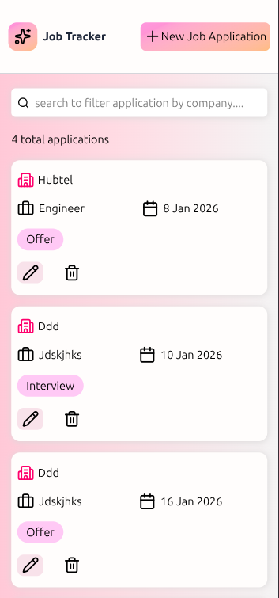
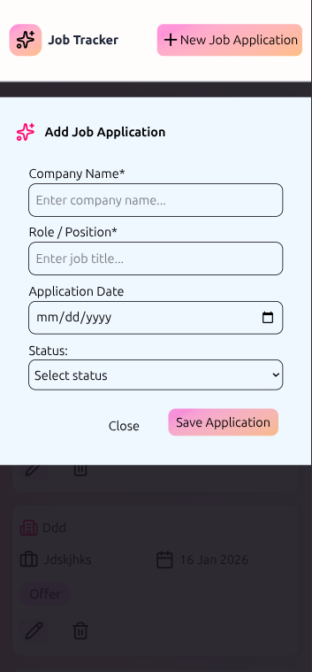
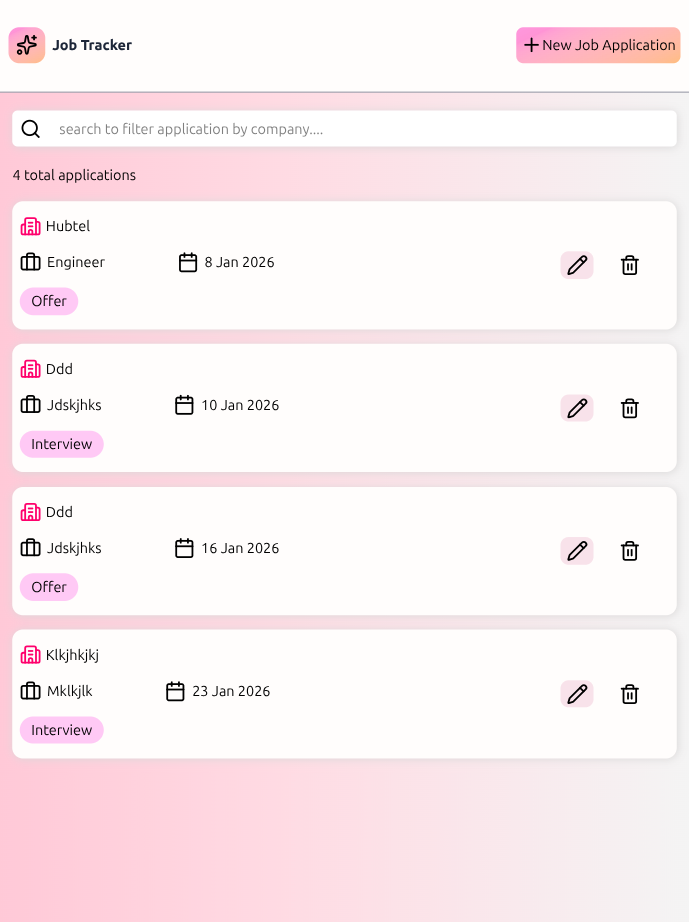

# Job Application Tracker

 A simple job application tracker that helps users log, update, search, and manage their job applications built with vanilla JavaScript and with localStorage.

### Features 
- Add new job applications
- View all saved applications
- Edit application status
- Delete applications
- Search applications by company name
- Data persistence using localStorage

### Built With
- HTML
- Tailwind
- JavaScript (Vanilla)
- localStorage

### How it works
Job applications are stored in an array and persisted using localStorage. The UI is dynamically rendered using JavaScript DOM manipulation.

### Screenshots

 
 
 

### Future Improvements
- Add filtering by status or date
- Add notes feature
- Add analytics feature

Created by **Georgina Akumiah**